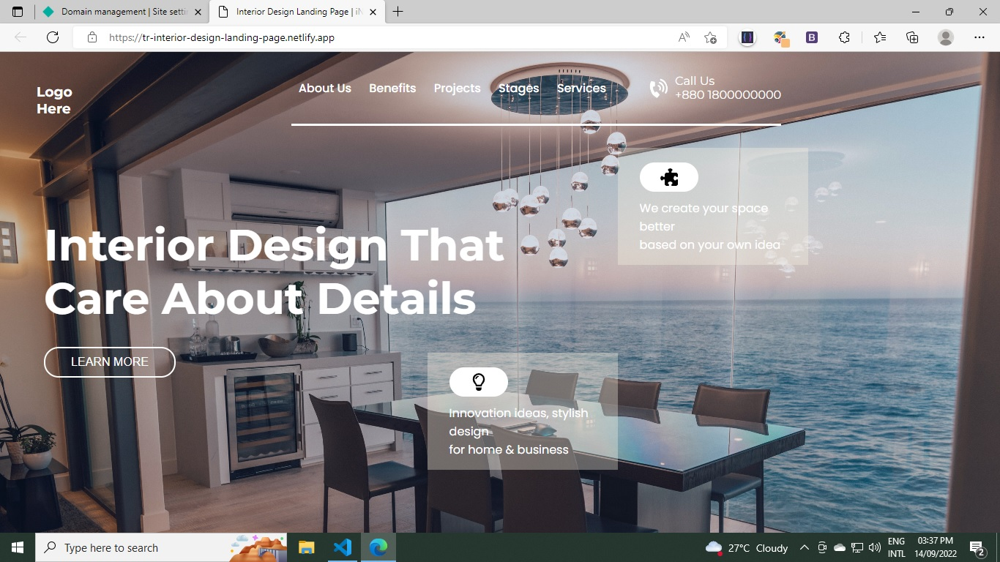
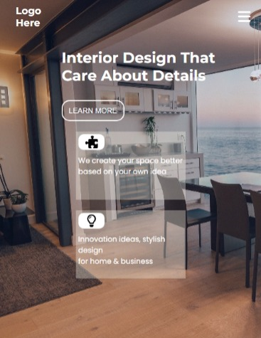

# Hi, This is Torjuman Rimon.

This is a Responsive landing page which is most like "Interior Design Landing Page". It is one of the live class project from iNeuron's Full Stack JavaScript Bootcamp given by **[Hitesh Sir](https://github.com/hiteshchoudhary)**

## Image from this project

 

### Desktop view

 

### Mobile view

 
 

- **What I have learnd in this project**

  - Full web page with Header, Hero Section and Footer
  - Media Queries
  - Icons placement
  - Mobile view
  - Flexbox
  - Wrap with flex
  - Hide elements at certain break point
  - Card design

 

- **Time needed to finish this project**

  - 4 : 00 hours

 

- **Challenges**

  - Background image palcement

   

- **[Live Link](https://tr-interior-design-landing-page.netlify.app/)**

# Tech used

 

